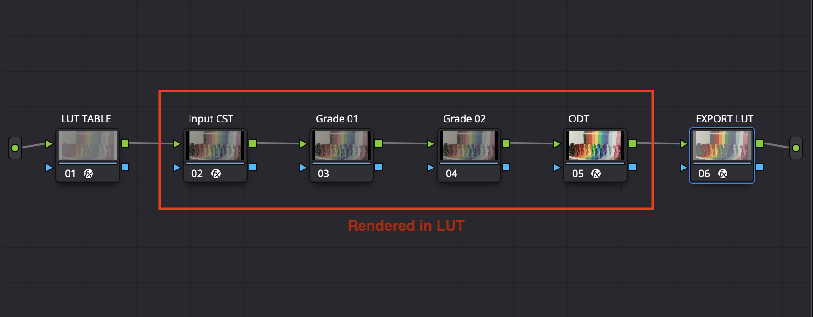

# LSP LUT Generator (OFX)

**LSP LUT Generator** is an **OFX** plug-in for **DaVinci Resolve**. Use one instance to fill the frame with a **3D LUT table** and another after your grade to analyze the graded image and export a matching **`.cube`** LUT.

## What it does

- **Generate LUT Table** — Draws the largest feasible n×n×n LUT table for the current resolution.
- **Analyze & export LUT** — Uses **Source** (graded table), solves at max size, then optionally box-downsamples to **Export LUT size** when that size divides the max.
- **Export LUT** — Writes a **`.cube`** file.
- **Rendering:** **CPU** only, multithreaded where applicable.



**In Resolve:** **Effects** → **OpenFX** → **LSP - Color** → **LSP LUT Generator**.

## Platform

- **macOS** only for now.

## Build

From the repository root:

```bash
make
```

This writes **`plugin/version_gen.h`**, **`build/`** intermediates, and **`release/LSP_LutGenerator_<version>.ofx.bundle`**.

### Release zip (binary for GitHub)

Once:

```bash
chmod +x tools/make_release.sh.example
```

Each release:

```bash
./tools/make_release.sh.example
```

This runs **`make clean && make`**, then writes **`release/LSP_LutGenerator_<version>_macOS_universal.zip`** (the **`.ofx.bundle`**). Attach that zip as a **Release** asset on GitHub. For source code, use GitHub’s built-in **Source code (zip/tar.gz)** on the release page.

## Installation

### Option A — Install from your own build (macOS)

```bash
sudo make install
```

This copies the bundle to **`/Library/OFX/Plugins`**, then runs **`make purge`** so Resolve rescans plug-ins (removes **`OFXPluginCacheV2.xml`** and legacy **`OFXPluginCache.xml`** for the relevant user home — under **`sudo`**, **`SUDO_USER`**’s Library is used). To install **without** clearing the cache:

```bash
sudo make install SKIP_RESOLVE_OFX_CACHE_PURGE=1
```

**Tip:** Quit DaVinci Resolve before installing when possible, then restart the app.

**Purge cache only** (same paths as install): **`make purge`**.

### Option B — Manual copy (e.g. from a release ZIP)

1. Download the build from the latest release and copy into:
   - **`/Library/OFX/Plugins/`** (all users), or  
   - **`~/Library/OFX/Plugins/`** (current user only)
2. Restart DaVinci Resolve (and purge the OFX cache if the plug-in does not appear — see above).

**Finder shortcut to the system plug-ins folder:** **Go** → **Go to Folder…** (**⇧⌘G**), then enter:

```text
/Library/OFX/Plugins/
```

## macOS Gatekeeper (unsigned / not notarized builds)

Prebuilt bundles may be blocked by Gatekeeper.

### Method 1 — Terminal (common approach)

Adjust the bundle name to match your installed version, then run:

```bash
sudo chmod -R 755 /Library/OFX/Plugins/LSP_LutGenerator_1.0.1.ofx.bundle
sudo chown -R root:wheel /Library/OFX/Plugins/LSP_LutGenerator_1.0.1.ofx.bundle
sudo xattr -dr com.apple.quarantine /Library/OFX/Plugins/LSP_LutGenerator_1.0.1.ofx.bundle
sudo codesign --force --deep --sign - /Library/OFX/Plugins/LSP_LutGenerator_1.0.1.ofx.bundle
```

Then relaunch DaVinci Resolve.

### Method 2 — System Settings

1. Install the bundle to **`/Library/OFX/Plugins/`**.
2. Open Resolve; if macOS warns, dismiss with **Done**.
3. Open **System Settings** → **Privacy & Security** and use **Allow Anyway** for the blocked plug-in if shown.
4. In Resolve: **Preferences** → **Video Plugins** — enable the plug-in, save, quit, and relaunch; confirm **Open Anyway** if prompted.